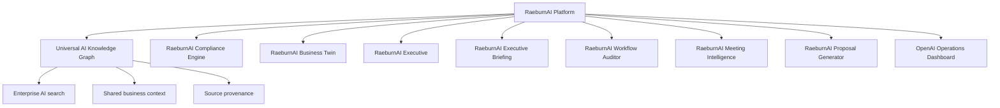
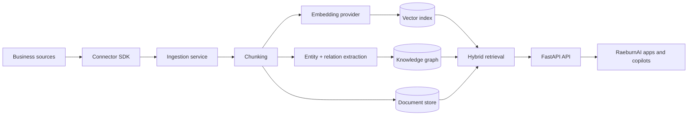

# Universal AI Knowledge Graph

   

## One-line positioning statement

Enterprise semantic knowledge graph that makes documents, emails, Slack, CRM, GitHub, databases and business systems searchable by AI.

## Short product description

Universal AI Knowledge Graph is the knowledge layer for the RaeburnAI ecosystem. It ingests business knowledge from structured and unstructured systems, normalises it into a common document model, extracts entities and relationships, creates embeddings, preserves provenance, and exposes AI-searchable retrieval APIs.

It is designed as a secure, testable and deployable open-source foundation for enterprise AI search, knowledge management, copilots and decision-support products.

## Part of the RaeburnAI Platform

This project is one module of the RaeburnAI Platform: an open, modular enterprise AI operating layer for workflow automation, governance, knowledge, executive intelligence and business transformation.

All RaeburnAI repositories follow the same standards:

- Production-first architecture
- Secure-by-default configuration
- Clear open-source documentation
- Docker-based local deployment
- CI, tests, linting and type checking
- Practical enterprise use cases
- Honest production-readiness notes and TODOs

### Ecosystem map



### Core RaeburnAI project links

- [RaeburnAI Compliance Engine](https://github.com/The-Raeburn-Group/RaeburnAI-Compliance-Engine)
- [Universal AI Knowledge Graph](https://github.com/The-Raeburn-Group/Universal-AI-Knowledge-Graph)
- [RaeburnAI Business Twin](https://github.com/The-Raeburn-Group/RaeburnAI-Business-Twin)
- [RaeburnAI Executive](https://github.com/The-Raeburn-Group/RaeburnAI-Executive)
- [RaeburnAI Executive Briefing](https://github.com/The-Raeburn-Group/RaeburnAI-Executive-Briefing)
- [RaeburnAI Workflow Auditor](https://github.com/The-Raeburn-Group/RaeburnAI-Workflow-Auditor)
- [RaeburnAI Meeting Intelligence](https://github.com/The-Raeburn-Group/RaeburnAI-Meeting-Intelligence)
- [RaeburnAI Proposal Generator](https://github.com/The-Raeburn-Group/RaeburnAI-Proposal-Generator)
- [OpenAI Operations Dashboard](https://github.com/The-Raeburn-Group/OpenAI-Operations-Dashboard)

## Core features

- Semantic search across enterprise knowledge sources
- Connector SDK for PDFs, JSON and future systems
- Document normalisation, chunking and provenance metadata
- Local deterministic embeddings for no-key development
- Optional OpenAI embedding provider
- Entity and relationship extraction
- Hybrid search response model with graph context
- FastAPI REST API with OpenAPI documentation
- Health, readiness and metrics endpoints
- Structured JSON logging
- API-key protection for private deployments
- Basic in-memory rate limiting
- Audit-event logging for sensitive actions
- Docker and Docker Compose deployment
- CI with linting, type checking, tests, package build and Docker build
- CodeQL and dependency review workflow
- Dependabot configuration

## Architecture



See [`docs/ARCHITECTURE.md`](docs/ARCHITECTURE.md) for implementation details.

## Quick start

```bash
cp .env.example .env
docker compose up --build
```

API endpoints:

- `GET /health`
- `GET /ready`
- `GET /metrics`
- `POST /v1/ingest`
- `POST /v1/search`

Local development:

```bash
python -m venv .venv
. .venv/bin/activate
make install
make lint
make typecheck
make test
make build
make docker-build
make run
```

## Environment variables

| Variable | Required | Default | Description |
| --- | --- | --- | --- |
| `UKG_ENVIRONMENT` | No | `development` | Runtime environment name. |
| `UKG_API_KEY` | Production yes | empty | Static API key for private deployments. Replace with OIDC/JWT for enterprise use. |
| `UKG_DATABASE_URL` | Production yes | local Postgres | Database URL for future durable storage. |
| `UKG_EMBEDDING_PROVIDER` | No | `local-hash` | Use `local-hash` or `openai`. |
| `UKG_EMBEDDING_DIMENSIONS` | No | `384` | Local embedding vector size. |
| `UKG_OPENAI_API_KEY` | Only for OpenAI embeddings | empty | OpenAI API key. |
| `UKG_MAX_CHUNK_CHARS` | No | `1600` | Maximum chunk size. |
| `UKG_CHUNK_OVERLAP_CHARS` | No | `200` | Chunk overlap size. |
| `UKG_LOG_LEVEL` | No | `INFO` | Logging level. |

See [`.env.example`](.env.example).

## Usage examples

Ingest manual content:

```bash
curl -X POST http://localhost:8000/v1/ingest \
  -H 'Content-Type: application/json' \
  -d '{
    "workspace_id": "demo",
    "source": "manual",
    "title": "CRM renewal note",
    "body": "Acme Corp renewal is at risk because procurement needs security review.",
    "metadata": {"system": "crm", "owner": "sales"}
  }'
```

Search:

```bash
curl -X POST http://localhost:8000/v1/search \
  -H 'Content-Type: application/json' \
  -d '{"workspace_id":"demo","query":"Which customers have security review risks?","limit":5}'
```

Ingest demo JSON through the CLI:

```bash
universal-kg ingest-file demo json examples/demo_records.json
```

## Security model

Current controls:

- Optional API-key authentication
- Strict request validation with Pydantic
- Basic rate limiting
- Structured JSON logs
- Audit-event logging for ingestion and search
- No committed secrets
- Least-privilege connector guidance
- Restricted CORS defaults for local development
- CodeQL, dependency review and Dependabot configuration

Production TODOs before handling sensitive enterprise data at scale:

- Replace static API key with SSO/OIDC and JWT validation.
- Add workspace-level RBAC.
- Store connector credentials in a managed secret store.
- Replace in-memory audit events with durable audit tables.
- Add deletion/export workflows for data protection requests.

See [`SECURITY.md`](SECURITY.md) and [`docs/PRIVACY_AND_DATA_PROTECTION.md`](docs/PRIVACY_AND_DATA_PROTECTION.md).

## Production readiness

This repository is a production-grade foundation, not a finished hosted SaaS product.

Ready now:

- Install, lint, typecheck, test, build and Docker build commands
- API service with health checks
- Connector SDK
- Demo data
- CI and security scanning
- Deployment documentation

Remaining blockers are documented in [`docs/DEPLOYMENT.md`](docs/DEPLOYMENT.md) and [`docs/ROADMAP.md`](docs/ROADMAP.md).

## Roadmap

- Durable Postgres and pgvector persistence
- Workspace RBAC and SSO/OIDC
- Live Gmail, Slack, CRM, GitHub and database connectors
- Encrypted connector credential store
- Queue-backed ingestion workers
- Admin UI and graph explorer
- Graph traversal retrieval
- Human approval workflows for risky write actions

See [`docs/ROADMAP.md`](docs/ROADMAP.md).

## Contributing

Contributions are welcome. Start with [`CONTRIBUTING.md`](CONTRIBUTING.md).

Before opening a pull request:

```bash
make install
make lint
make typecheck
make test
make build
make docker-build
```

## Licence

Apache License 2.0. See [`LICENSE`](LICENSE) and [`NOTICE`](NOTICE).
