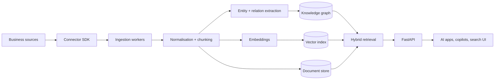

# Universal AI Knowledge Graph

Enterprise semantic knowledge graph for making documents, emails, Slack conversations, CRM records, GitHub repositories, databases and business systems searchable by AI.

This project is designed as a production-ready open-source foundation: secure by default, connector-based, observable, testable, and deployable with Docker.

## What it does

Universal AI Knowledge Graph ingests knowledge from many business systems, extracts entities and relationships, creates embeddings, stores graph edges, and exposes AI-searchable retrieval APIs.

Supported first-class ingestion patterns:

- PDFs and office documents
- Email exports / IMAP compatible inboxes
- Slack exports and API payloads
- CRM objects such as companies, contacts, deals and notes
- GitHub repositories, issues and pull requests
- SQL databases
- Generic JSON / CSV business data

## Core capabilities

- Semantic search across all connected sources
- Knowledge graph entity and relationship extraction
- Hybrid retrieval combining vector, keyword and graph context
- Source provenance and citation metadata
- Multi-tenant workspace model
- Connector SDK for new systems
- Background ingestion jobs
- REST API with OpenAPI docs
- Production Docker Compose stack
- Postgres + pgvector for durable storage
- Optional Neo4j-compatible graph adapter interface
- Auth-ready API boundary
- Structured logs, health checks and metrics endpoint
- CI, linting, type checks and tests

## Architecture



## Quick start

```bash
cp .env.example .env
docker compose up --build
```

API documentation will be available at:

- `http://localhost:8000/docs`
- `http://localhost:8000/health`

Run locally without Docker:

```bash
python -m venv .venv
. .venv/bin/activate
pip install -e '.[dev]'
uvicorn universal_kg.api.main:app --reload
```

Run tests:

```bash
pytest
ruff check .
mypy src
```

## API examples

Ingest generic content:

```bash
curl -X POST http://localhost:8000/v1/ingest \
  -H 'Content-Type: application/json' \
  -d '{
    "workspace_id": "demo",
    "source": "manual",
    "title": "CRM renewal note",
    "body": "Acme Corp renewal is at risk because procurement needs security review.",
    "metadata": {"system": "crm", "owner": "sales"}
  }'
```

Search:

```bash
curl -X POST http://localhost:8000/v1/search \
  -H 'Content-Type: application/json' \
  -d '{"workspace_id":"demo","query":"Which customers have security review risks?","limit":5}'
```

## Production principles

This repository intentionally avoids being a toy demo. The first release includes:

- Explicit domain model
- Connector contracts
- Replaceable embedding provider
- Replaceable graph provider
- Durable database migrations
- Security and privacy documentation
- CI workflow
- Containerised deployment path
- Clear roadmap for enterprise integrations

## Roadmap

See [`docs/ROADMAP.md`](docs/ROADMAP.md).

## Security

See [`SECURITY.md`](SECURITY.md) and [`docs/PRIVACY_AND_DATA_PROTECTION.md`](docs/PRIVACY_AND_DATA_PROTECTION.md).

## Licence

Apache License 2.0. See [`LICENSE`](LICENSE).
